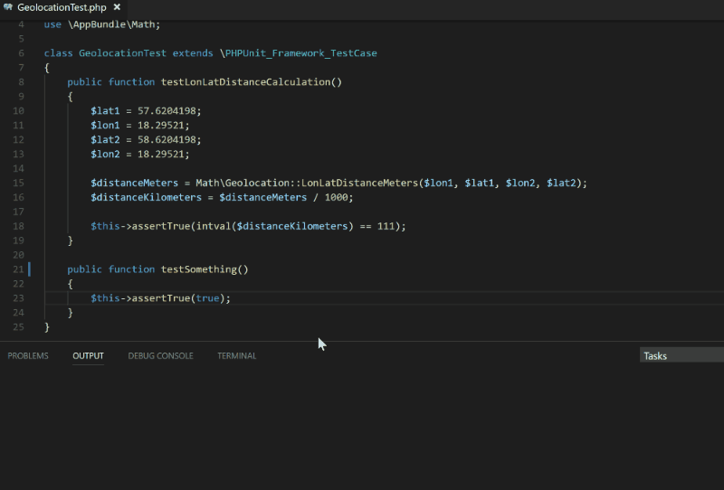

# [v4.0.0](https://github.com/elonmallin/vscode-phpunit/releases/tag/v4.0.0)
- **BREAKING CHANGE** Updated vscode engine version required to latest 1.27.0.
- Add color output and show failed tests in problems pane by running a task using a problem matcher.
- Add config property `phpunit.docker.image` for choosing docker image for DockerDriver.

# [v3.1.0](https://github.com/elonmallin/vscode-phpunit/releases/tag/v3.1.0)
- Can now run php through docker. Will look for phpunit in all normal places (path, composer, phar).
- Add Stop running phpunit command (kill process).
- **Bugfix:** Prevent output window from stealing focus.
- Update vscode, typescript and other packages.

# [v3.0.0](https://github.com/elonmallin/vscode-phpunit/releases/tag/v3.0.0)
- Now uses global php if not set at `phpunit.php` (previously `phpunit.execPath`)
  - `phpunit.execPath` still works for backwardscompatibility but is deprecated.
- Now tries to find phpunit in the project folder (composers vendor dir and .phar files).
- Will clear the output after each run (option: `clearOutputOnRun` default=true).

# [v2.2.1](https://github.com/elonmallin/vscode-phpunit/releases/tag/v2.2.1)
- Add command `phpunit.RerunLastCommand`. Will run the last command again and can be bound to hotkey.

# [v2.1.1](https://github.com/elonmallin/vscode-phpunit/releases/tag/v2.1.1)
- **Bugfix:** Function tests again allows `@test` docblocks and not just `test*` prefix.

# [v2.1.0](https://github.com/elonmallin/vscode-phpunit/releases/tag/v2.1.0)
- **Bugfix:** Run the instant tests reliably if the cursor is in the right place. Not every other try.
- Add config option preferRunClassTestOverQuickPickWindow (default: false). Set to true to never show the quick pick window and just test the whole class if the cursor is on anything other than a function name.

# [v2.0.1](https://github.com/elonmallin/vscode-phpunit/releases/tag/v2.0.1)
- **Bugfix:** Make sure the output channel is shown on test run.

# [v2.0.0](https://github.com/elonmallin/vscode-phpunit/releases/tag/v2.0.0)
- This release shows the quick pick window to select a test when you run "PHPUnit Test" not directly on a function or class. If you have the cursor directly on the class or function name it will run instantly just like in previous releases.

  

- Multiple projects can be used with the "PHPUnit Test Directory" command since full paths will now be used to locate the directory.