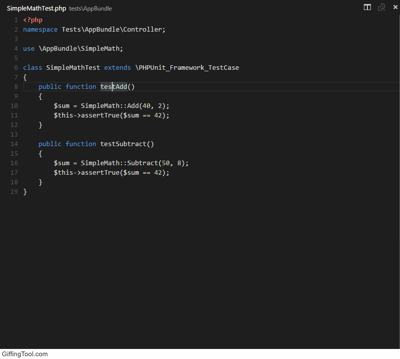
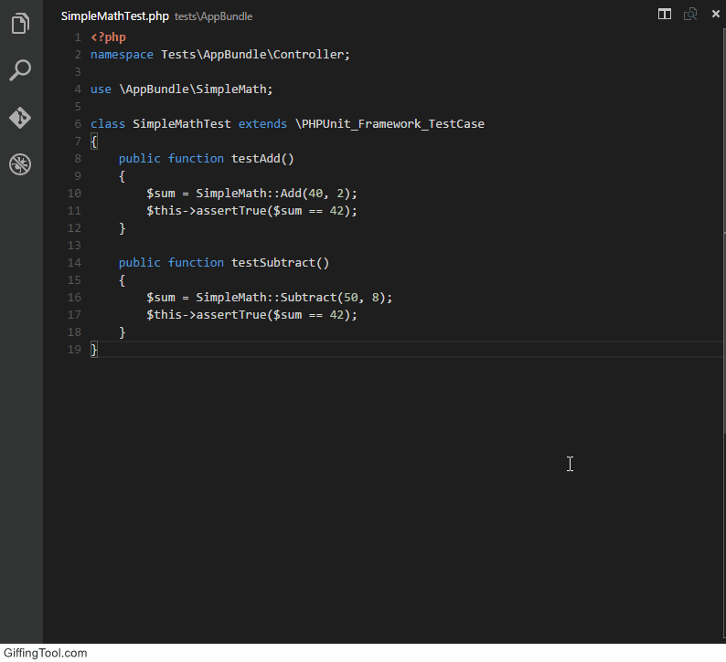
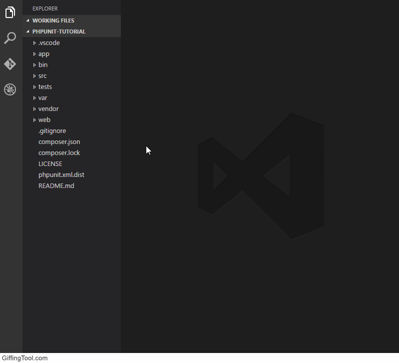

# Phpunit for VSCode
## Setup
* Install [phpunit](https://phpunit.de/).
* Set the config values:
```JSON
{
    "phpunit.execPath": "path/to/phpunit", // Recommended to put in your 'user settings'. Having phpunit in PATH doesn't work =(
    "phpunit.args": [
        "--configuration", "./phpunit.xml.dist" // Recommended to put in your 'workspace settings'. Example: Add a configuration found in root.
    ]
}
```

## How to use
Run with (`Cmd+Shift+P` on OSX or `Ctrl+Shift+P` on Windows and Linux) and execute the `phpunit` command.
* **Test a function**: Place cursor on a function and run.



* **Test a class**: Place cursor anywhere in class (except on a function) and run.


* **Test everything according to --configuration**: Close editor window and run.



* **Test everything in a directory**: Open a file in the directory to test and run the `phpunit directory` command.

